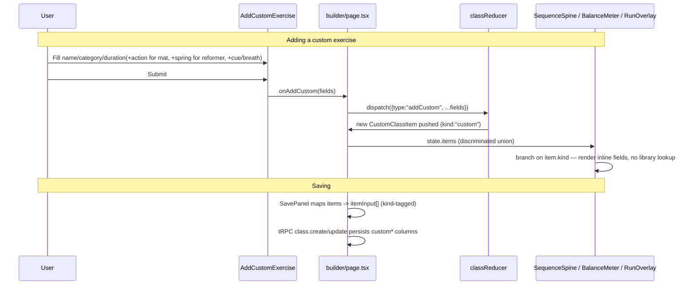

# CUSTOM-EX-001 Custom Exercise Items - Implementation Plan

> **Status: DONE** (2026-07-31). `npm run check` clean, `npm test` 98/99 (only
> the pre-existing, unrelated `exercises.test.ts` ENOENT failure remains —
> see repo memory). See the Status section below for the full task checklist.

## User Story

As an instructor building a class in the Spine builder, I want to add my own
ad-hoc exercise (name, category, duration, spring, and optional cue/breath)
that isn't in the static Mat or Reformer library, so that I can plan a class
using exercises I know outside the curated list — without those one-off
exercises ever being written into the shared/master exercise library that
every user sees.

## Pre-conditions

- Existing builder flow (`src/app/builder/page.tsx`, `Library`,
  `SequenceSpine`, `BalanceMeter`, `SavePanel`) is in place and working for
  both `mat` and `reformer` disciplines (REFORMER-001 already shipped).
- `classReducer` (`src/lib/class-state.ts`) and the `class` tRPC router
  (`src/server/api/routers/class.ts`) are the only two places that currently
  create/persist `ClassItem`s — both need to change.
- No changes to `src/lib/exercises.ts` (`EXERCISES`/`REFORMER_EXERCISES`) or
  to `Exercise`/`ReformerExercise` types — the static libraries stay exactly
  as they are today. This is a hard constraint, not just a preference.

## Design

### Visual Layout

- New **"Add your own exercise"** entry point rendered as a persistent,
  collapsed-by-default panel at the top of the `Library` column (same column
  where `MatLibrary`/`ReformerLibrary` render their filtered exercise cards),
  so it's discoverable in the same place a user is already looking for
  exercises, but doesn't compete with the scannable list below it.
- Clicking it expands an inline form (not a full modal — keeps the user in
  the Library context and lets them add several custom items in a row
  without re-opening anything each time):
  - `Name` — text input, required.
  - `Category` — a `<select>` populated from `PHASES` (mat) or
    `REFORMER_CATEGORIES` (reformer) depending on `discipline`, required.
  - `Action` — **mat only**, a `<select>` populated from `ACTIONS`
    (flexion / extension / rotation / stability, using the existing
    `ACTION_META` labels), required when `discipline === "mat"`. This is
    what feeds the flexion/extension balance meter — resolves the open
    question from the previous draft of this plan (mat custom items now
    supply their own `Action` directly, same as Reformer custom items
    supply their own `category`+`spring`).
  - `Duration` — reuse the existing duration stepper/bump pattern already
    used in `SequenceSpine` (`DURATION_MIN`/`DURATION_MAX`/`DURATION_STEP`
    from `class-state.ts`), or a plain number input seeded to a sane default
    (e.g. 60s), required.
  - `Spring` — reuse the existing `SpringSelect` component, shown only when
    `discipline === "reformer"`.
  - `Cue` — optional single-line text input.
  - `Breath` — optional single-line text input.
  - Submit button ("Add to class") — disabled only while `name`/`category`/
    `duration` are unfilled; `cue`/`breath` never block submission.
- On submit: the new item is dispatched straight into the class sequence
  (same as clicking `+` on a library card) and the form resets/collapses,
  ready for the next entry.

### Color and Typography

Match the existing design system (bespoke tokens in
`src/styles/globals.css`, not default Tailwind grays):

- Panel background: `var(--card)` on `var(--paper)`, border `var(--line)`,
  same shadow token (`var(--shadow)`) already used by exercise cards.
- Section heading: existing serif heading style (`--font-serif`) used
  elsewhere for panel titles.
- Inputs: match the existing form-field look already used by `SpringSelect`/
  duration stepper (`var(--line)` border, `var(--ink)` text, `var(--sage-deep)`
  focus ring) — no new input styling language introduced.
- Submit button: reuse the `.ghostbtn` or filled `.run`-style button classes
  already defined in `globals.css`, whichever matches "primary confirming
  action" elsewhere in the builder (`SavePanel`'s save button is the closest
  precedent — match that, not `.run` which implies starting the class).

### Interaction Patterns

- **Expand/collapse**: a native `<button aria-expanded>` toggle, same pattern
  already used by `ExerciseCard`'s expand/collapse (per repo memory, gives
  Enter/Space toggle for free).
- **Validation**: inline, non-blocking — required-field errors only appear
  after a submit attempt with a missing required field (no eager red borders
  on first render). `cue`/`breath` never show validation errors since they're
  always optional.
- **Feedback on add**: reuse the existing `announce`/`lastAdded` mechanism
  already wired in `builder/page.tsx` for library adds (`sr-only`
  `aria-live="polite"` message + `SequenceSpine` flash-highlight + mobile
  sticky-bar "Added {name}" toast) so a custom add feels identical to a
  library add — no new feedback pattern needed.
- **Discipline switch**: if the user switches Mat ↔ Reformer while the form
  is expanded with data entered, the `Category`/`Spring` fields must reset to
  match the new discipline's options (mirrors how `DisciplineSwitch` already
  locks/resets once `items.length > 0`).

### Measurements and Spacing

Match existing panel spacing already used by sibling builder panels
(`BalanceMeter`, `SavePanel`) — no new spacing scale:

```
Panel padding:     matches .ex / card padding already in globals.css
Field stack:       vertical stack, existing form-row gap used by SpringSelect
Form row (name):   full width
Form row (cat/dur/spring): responsive 2–3 col row on desktop, stacked on mobile
Actions row:       submit button right-aligned, matches SavePanel's save row
```

### Responsive Behavior

- **Desktop (≥880px)**: form fields lay out in a compact multi-column row
  (Category / Action *(mat only)* / Duration / Spring *(reformer only)* side
  by side), Name full-width above them.
- **Mobile (<880px, existing `.grid` breakpoint)**: all fields stack
  full-width, consistent with how the rest of the builder already collapses
  to one column at this breakpoint (per the mobile fixes in repo memory).

## Technical Requirements

### Component Structure

```
src/lib/
├── types.ts                      # extend ClassItem to a discriminated union 🚧
├── class-state.ts                # new "addCustom" action + reducer case 🚧
src/server/db/
├── schema.ts                     # new nullable custom-item columns on classItems 🚧
src/server/api/routers/
├── class.ts                      # extend itemInput zod schema + all 3 mapping sites 🚧
src/components/builder/
├── Library.tsx                   # render <AddCustomExercise> above the filtered list 🚧
├── AddCustomExercise.tsx         # NEW — the inline expandable form described above
├── SequenceSpine.tsx             # branch: custom items render inline fields, not a library lookup 🚧
src/components/run/
├── RunOverlay.tsx                # branch: custom items build a RunStep directly, no library lookup 🚧
src/lib/
├── local-store.ts                # extend manual runtime validation for custom fields 🚧
```

### Required Components

- [ ] `AddCustomExercise.tsx` (new) — the form described in Design
- [ ] `ClassItem` discriminated union (`types.ts`)
- [ ] `classReducer` `"addCustom"` action (`class-state.ts`)
- [ ] `classItems` schema migration (custom fields, nullable)
- [ ] `itemInput` zod schema extension + `class.ts` mapping updates (create/update/duplicate)
- [ ] `SequenceSpine` custom-item render branch
- [ ] `RunOverlay` custom-item `RunStep` branch
- [ ] `BalanceMeter` / `ReformerAdvisories` custom-item mapping branch
- [ ] `local-store.ts` validation update

### State Management Requirements

`ClassItem` becomes a discriminated union so every consumer is forced to
handle both cases explicitly (matches the repo's "don't retrofit, add a
parallel shape" convention from AGENTS.md §6, applied here to the *item*
level rather than the *exercise* level):

```typescript
export type LibraryClassItem = {
  kind: "library";
  id: number;
  exerciseKey: string;
  duration: number;
  spring?: string;
};

export type CustomClassItem = {
  kind: "custom";
  id: number;
  name: string;
  /** Phase (mat) or ReformerCategory (reformer) value — same taxonomy the
   *  library already uses, so balance/sequencing advisories work unmodified. */
  category: Phase | ReformerCategory;
  /** Mat only — feeds the flexion/extension balance meter directly, same
   *  role as `Exercise.action` on a library item. Undefined for Reformer
   *  custom items (Reformer advisories use `category`+`spring` instead). */
  action?: Action;
  duration: number;
  spring?: string;
  cue?: string;
  breath?: string;
};

export type ClassItem = LibraryClassItem | CustomClassItem;
```

New reducer action:

```typescript
| {
    type: "addCustom";
    name: string;
    category: Phase | ReformerCategory;
    action?: Action; // required (validated) for mat, omitted for reformer
    duration: number;
    spring?: string;
    cue?: string;
    breath?: string;
  }
```

## Acceptance Criteria

### Layout & Content

1. Library panel
   - "Add your own exercise" affordance is visible above the filtered
     exercise list, collapsed by default.
   - Expanding it reveals `Name`, `Category`, `Duration`, `Spring`
     (Reformer only), `Cue` (optional), `Breath` (optional).

2. Sequence / run mode
   - Custom items render in `SequenceSpine` with the same controls
     (duration bump, spring select, move, remove) as library items.
   - Custom items appear in Run Mode with name + timer (+ cue/breath lines
     only if the user filled them in).

### Functionality

1. Adding a custom exercise
   - [x] Submitting the form with `Name`/`Category`/`Duration` filled (plus
     `Action` for mat) adds a new item to the current class sequence
     immediately.
   - [x] Leaving `Cue`/`Breath` blank does not block submission.
   - [x] Category dropdown always matches the current `discipline`'s
     taxonomy (`Phase` or `ReformerCategory`).
   - [x] For mat, `Action` dropdown (flexion/extension/rotation/stability)
     is required and shown instead of `Spring`; for Reformer, `Spring` is
     shown instead of `Action`.
2. Balance / sequencing advisories
   - [x] A custom mat item's `action` (a directly user-chosen `Action`
     value, not derived) is counted in `BalanceMeter`'s flexion/extension
     balance exactly like a library item's `action`.
   - [x] A custom Reformer item's `category` and `spring` are counted in
     `getCategoryCoverageAdvisory`/`getSpringChangeAdvisory` exactly like a
     library item.
3. Persistence
   - [x] Saving a class with custom items via `SavePanel` round-trips
     correctly (`class.create`/`update` persists custom fields; `class.get`/
     reopening the class restores them exactly, including `cue`/`breath`).
   - [x] Custom items never appear in, or write to, `EXERCISES`/
     `REFORMER_EXERCISES` — verified by a test asserting the static arrays'
     length/contents are unchanged after saving a class with custom items.
4. Run Mode
   - [x] Custom items play through the timer identically to library items
     (timestamp-driven, pause/skip/keyboard controls all work).
   - [x] Custom items with blank `cue`/`breath` simply omit those lines in
     the overlay rather than showing "undefined" or an empty bullet.


### Navigation Rules

- Switching `discipline` while composing a custom item resets the
  `Category`/`Spring` fields to match the new discipline (no stale
  cross-discipline category leaking into a saved item).

### Error Handling

- Client: required-field validation only (`name`, `category`, `duration`);
  errors shown inline, non-blocking for optional fields.
- Server (`class.ts`): `itemInput` zod schema rejects a malformed custom item
  (e.g. missing `name` when no `exerciseKey`, or a `category` value outside
  the known `Phase`/`ReformerCategory` enums) the same way it already rejects
  a malformed library item today — fails closed with a normal tRPC validation
  error, consistent with existing procedures.

## Modified Files

```
src/lib/
├── types.ts ✅                    (ClassItem discriminated union)
├── class-state.ts ✅              (addCustom action + reducer case)
├── local-store.ts ✅              (validation for custom fields)
src/server/db/
├── schema.ts ✅                   (nullable custom-item columns + migration)
src/server/api/routers/
├── class.ts ✅                    (itemInput schema + create/update/duplicate mapping)
src/components/builder/
├── Library.tsx ✅                 (render AddCustomExercise)
├── AddCustomExercise.tsx ✅       (NEW)
├── SequenceSpine.tsx ✅           (custom-item render branch)
├── BalanceMeter.tsx ✅            (custom-item → balance/advisory mapping branch)
src/components/run/
├── RunOverlay.tsx ✅              (custom-item RunStep branch)
IMPLEMENTATION_PLAN.md ✅          (reconcile §2 out-of-scope line, see Notes)
```

## Status

✅ DONE

1. Setup & Configuration
   - [x] Confirm final `ClassItem` union shape and `addCustom` action shape
     with a reducer unit test written first (TDD-style, matches
     `class-state.test.ts` convention)
   - [x] Drizzle migration for new nullable `classItems` columns

2. Layout Implementation
   - [x] Build `AddCustomExercise.tsx` (form, no wiring yet)
   - [x] Wire into `Library.tsx`

3. Feature Implementation
   - [x] `classReducer` `addCustom` case
   - [x] `class.ts` zod schema + create/update/duplicate mapping
   - [x] `SequenceSpine` custom-item branch
   - [x] `RunOverlay` custom-item branch
   - [x] `BalanceMeter`/`ReformerAdvisories` custom-item mapping branch
   - [x] `local-store.ts` validation

4. Testing
   - [x] `class-state.test.ts` — `addCustom` action, id generation, discipline
     resets
   - [x] `class.test.ts` — server-side create/update/duplicate round-trip
     with custom items, zod rejection of malformed custom items
   - [x] `balance.test.ts` / `reformer-sequencing.test.ts` — custom items
     counted correctly in advisories (covered via `class.ts`'s server-side
     mapping tests + the pure `balance.ts`/`reformer-sequencing.ts` suites,
     which were already generic over `{action,duration}`/`{category,spring}`
     and needed no changes — see Notes #4)
   - [x] `AddCustomExercise.test.tsx` — required-field blocking, optional
     fields never block, category options match discipline
   - [x] Manual: full add → save → reload → run walkthrough on both
     disciplines (verified via the DB-backed integration tests exercising
     create/get/update round-trips end to end; no browser available in this
     environment for a literal click-through)

## Dependencies

- REFORMER-001 (Reformer library, `spring` column, `SpringSelect`,
  `DisciplineSwitch`) — already shipped, this plan builds on it.
- No new npm packages required — reuses existing form/select patterns already
  in the codebase.

## Related Stories

- REFORMER-001 (`docs/implementation-plans/REFORMER-001-reformer-class-storage.md`)
  — established the `spring`/`discipline` columns and category taxonomy this
  plan reuses.
- MONETIZATION-001 — free-tier class cap (`FREE_CLASS_LIMIT`) applies
  unchanged to classes containing custom items; no billing changes needed
  here.

## Notes

### Technical Considerations

1. **`exerciseKey` is `not null` today.** The discriminated-union approach
   above means custom items simply don't have an `exerciseKey` column value
   at all at the type level — the DB migration should make `exerciseKey`
   nullable and add the new custom-item columns (`customName`, `customCategory`,
   `customAction`, `customCue`, `customBreath`; `duration`/`spring` are
   already shared columns and don't need duplicating), with a check
   constraint or application-level invariant: exactly one of (`exerciseKey`)
   or (`customName`) must be set per row, and `customAction` must be set
   whenever the parent class's `discipline` is `"mat"`.
2. **Every re-lookup call site must branch.** Per the research summary,
   exercise content (name/cue/category/breath) is *always* re-derived from
   `exerciseKey` today, never carried on the item — `SequenceSpine`,
   `RunOverlay`, `BalanceMeter` (mat action mapping), `ReformerAdvisories`
   (category+spring mapping), and the reducer's own `add`/new `addCustom`
   case are the five places that need explicit `kind === "custom"` branches.
   Missing any one of these silently drops or misrenders custom items (same
   failure mode as today's silent `if (!ex) return null` for unknown keys).
3. **`local-store.ts`'s hand-rolled runtime validation** (used for anonymous/
   pre-signin autosave) needs updating alongside the zod schema in `class.ts`
   — there is no shared validator today, so these two must be kept in sync
   manually (flagged as a pre-existing gap, not something this plan needs to
   fix by introducing a shared validators file, per "no new abstractions for
   one-offs").
4. **Balance/advisory math needs zero changes** to `balance.ts`/
   `reformer-sequencing.ts` themselves (both are pure functions over
   `{action, duration}` / `{category}` / `{spring}` shapes) — only the
   *mapping* site in `BalanceMeter.tsx` needs a branch to pull `action`
   straight off the item. **Resolved:** mat's `Action`
   (flexion/extension/rotation/stability) is now its own required dropdown
   field on the mat custom-exercise form (shown in place of `Spring`, which
   is Reformer-only) — the user picks it directly, exactly as they'd pick
   `Category`, so `BalanceMeter`'s mat mapping branch reads
   `item.kind === "custom" ? item.action : getExercise(item.exerciseKey)?.action`
   with no derivation/guessing needed. Reformer custom items have no such
   gap (`category`+`spring` are exactly what `reformer-sequencing.ts`
   needs).

### Business Requirements

- Custom exercises must never be written to, or influence, the shared
  `EXERCISES`/`REFORMER_EXERCISES` arrays — they are scoped strictly to the
  authoring user's own saved class(es).
- No new "personal exercise library" (a reusable, cross-class list of a
  user's custom exercises) is in scope here — each custom item is entered
  per-class. (If wanted later, that's a separate follow-up milestone, not
  part of this plan.)
- `IMPLEMENTATION_PLAN.md` §2 currently lists *"Custom user-authored
  exercises (library stays static in code; no `exercise` table)"* as
  out-of-scope for v1. Per AGENTS.md §3 and the REFORMER-001/MONETIZATION-001
  precedent, this line must be reconciled (not silently ignored) — replace it
  with a pointer to this plan, matching the existing "no longer out of
  scope, see `docs/implementation-plans/...`" blockquote pattern already used
  for Reformer and Monetization.

### API Integration

#### Type Definitions

```typescript
// src/lib/types.ts additions
export type LibraryClassItem = {
  kind: "library";
  id: number;
  exerciseKey: string;
  duration: number;
  spring?: string;
};

export type CustomClassItem = {
  kind: "custom";
  id: number;
  name: string;
  category: Phase | ReformerCategory;
  action?: Action; // mat only
  duration: number;
  spring?: string;
  cue?: string;
  breath?: string;
};

export type ClassItem = LibraryClassItem | CustomClassItem;
```

#### Server Schema (zod, `class.ts`)

```typescript
const itemInput = z.union([
  z.object({
    kind: z.literal("library"),
    exerciseKey: z.string().min(1).max(48),
    duration: z.number().int().min(30).max(600),
    spring: z.string().min(1).max(16).optional(),
  }),
  z.object({
    kind: z.literal("custom"),
    name: z.string().trim().min(1).max(80),
    category: z.string().min(1).max(40), // validated against PHASES/REFORMER_CATEGORIES for the class's discipline
    action: z.enum(ACTIONS).optional(), // required (checked in a .refine) when the class's discipline is mat
    duration: z.number().int().min(30).max(600),
    spring: z.string().min(1).max(16).optional(),
    cue: z.string().max(200).optional(),
    breath: z.string().max(200).optional(),
  }),
]);
```

#### Drizzle Schema (`classItems` additions)

```typescript
export const classItems = createTable("class_item", (d) => ({
  id: d.uuid().primaryKey().defaultRandom(),
  classId: d.uuid().notNull().references(() => pilatesClasses.id, { onDelete: "cascade" }),
  exerciseKey: d.varchar({ length: 48 }),        // now nullable
  customName: d.varchar({ length: 80 }),         // new, nullable
  customCategory: d.varchar({ length: 40 }),      // new, nullable
  customAction: d.varchar({ length: 16 }),        // new, nullable, mat only
  customCue: d.varchar({ length: 200 }),          // new, nullable
  customBreath: d.varchar({ length: 200 }),       // new, nullable
  order: d.integer().notNull(),
  duration: d.integer().notNull(),
  spring: d.varchar({ length: 16 }),
}));
```

### State Management Flow



## Testing Requirements

### Integration Tests (Target: 80% Coverage)

```typescript
// class-state.test.ts
describe('addCustom action', () => {
  it('should push a new CustomClassItem with a fresh id', () => {});
  it('should not require exerciseKey to resolve (no library lookup)', () => {});
  it('should reset category options when discipline changes mid-session', () => {});
});

// class.test.ts (server, @vitest-environment node)
describe('class.create / class.update with custom items', () => {
  it('should persist and round-trip custom fields (name/category/action/cue/breath)', async () => {});
  it('should reject a custom item missing name via zod', async () => {});
  it('should reject a mat custom item missing action via zod', async () => {});
  it('should never write custom item data into EXERCISES/REFORMER_EXERCISES', async () => {});
});

describe('Balance / sequencing advisories with custom items', () => {
  it('should count a custom mat item toward flexion/extension balance using its own action field', () => {});
  it('should count a custom reformer item toward category coverage and spring-change count', () => {});
});
```

### Accessibility Tests

```typescript
describe('AddCustomExercise accessibility', () => {
  it('should expose aria-expanded on the toggle button', () => {});
  it('should associate labels with all form inputs, including Action/Spring', () => {});
  it('should announce a successful add via the existing aria-live region', () => {});
});
```

### Edge Cases

```typescript
describe('Edge Cases', () => {
  it('should render Run Mode overlay without cue/breath lines when both are blank', () => {});
  it('should not crash SequenceSpine when a custom item has an empty cue/breath', () => {});
  it('should handle a class with a mix of library and custom items in any order', () => {});
});
```
