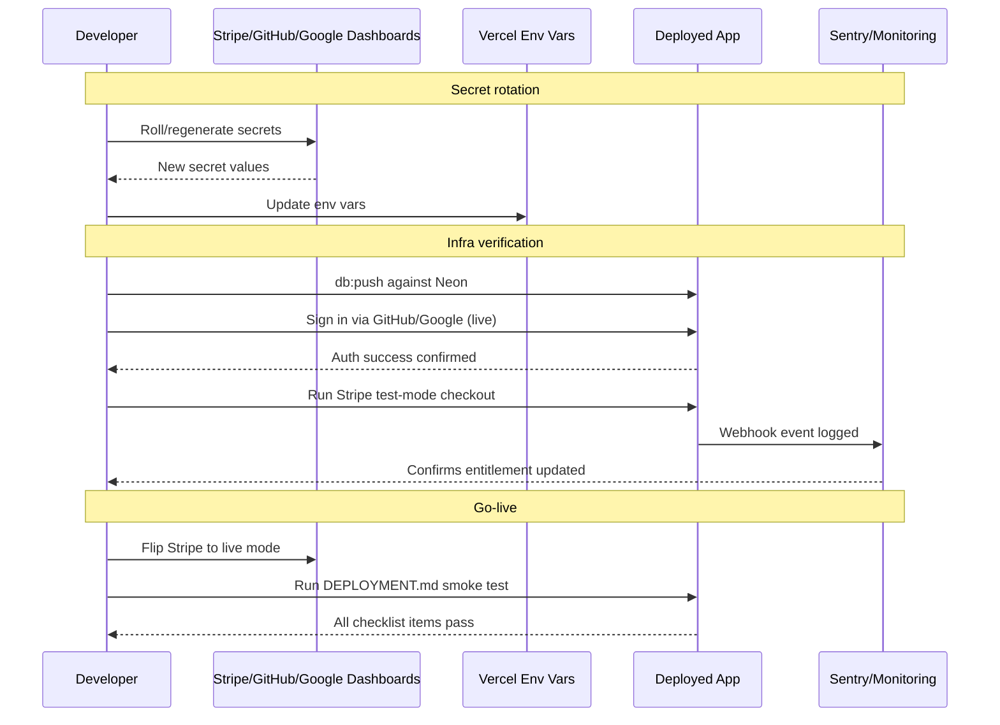

# LAUNCH-001 Production Launch Readiness - Implementation Plan

## User Story

As the Spine product owner, I want the app's secrets rotated, production infra
provisioned/verified, security and monitoring hardening in place, and legal
pages published, so that the app can be safely opened to the public without
exposing users, payments, or the business to unnecessary risk.

This is an **operational/infra readiness plan**, not a UI feature — most of
the template's visual-design sections are marked N/A below except where a
task produces real user-facing UI (the Privacy/Terms pages).

## Pre-conditions

- Core product (builder, run mode, save/load, auth, Stripe billing) is built
  and passes `npm run check` / `npm test` per `IMPLEMENTATION_PLAN.md`
  Phases 1–8 (all `[x]`).
- Phase 9 ("Deploy") in `IMPLEMENTATION_PLAN.md` is documented in
  `DEPLOYMENT.md` but **not executed** — no live Neon DB, no live OAuth
  round-trip, no live Stripe mode.
- Local `.env` currently holds real GitHub/Google OAuth secrets and a Stripe
  test-mode secret key + webhook secret, which were pasted into an AI chat
  session during this planning work.
- `next.config.js` has no custom headers; there is no `middleware.ts`; no
  rate limiting exists on `/api/checkout` or the tRPC endpoint; no error
  monitoring (e.g. Sentry) is wired up.
- No Terms of Service, Privacy Policy, or account-deletion path exists yet.

## Design

### Visual Layout

Only two tasks in this plan produce user-facing pages:

- **`/terms`** and **`/privacy`** — simple static content pages (long-form
  text), reusing the existing marketing/pricing page shell (header +
  wordmark, `.paper` background, single-column prose column, max-width
  matching `/pricing`).
- All other tasks (secret rotation, Neon/OAuth/Stripe live-mode setup,
  security headers, rate limiting, monitoring) are infra/config changes with
  no new UI.

### Color and Typography

Reuse existing tokens/typography from `src/styles/globals.css` — no new
tokens needed. Terms/Privacy body copy uses the same prose styles as other
static content (e.g. `/pricing` copy blocks): `--ink` body text, `Fraunces`
for section headings, `Hanken Grotesk` for body.

### Interaction Patterns

- Terms/Privacy pages are static/read-only — no interactive states beyond
  standard link/focus-visible styling already defined globally.
- A support-email-based "request account deletion" link (`mailto:`) on the
  account/billing page is the only new interactive element; it should follow
  the existing `.navlink` styling used elsewhere.

### Measurements and Spacing

Reuse existing static-page spacing (`/pricing` page as the reference) — no
new spacing scale needed.

### Responsive Behavior

- **Desktop / Tablet / Mobile**: single-column prose layout, already the
  pattern used by `/pricing`; no new responsive behavior to design.

## Technical Requirements

### Component Structure

```
src/app/
├── terms/
│   └── page.tsx                 # New — static ToS content (RSC)
├── privacy/
│   └── page.tsx                 # New — static Privacy Policy content (RSC)
└── account/
    └── billing/
        └── page.tsx             # Modified — add "request deletion" mailto link

next.config.js                   # Modified — add headers() for CSP/security headers
middleware.ts                    # New (repo root or src/) — rate limiting hook
src/server/billing/stripe.ts     # Modified — confirm live/test key selection by env
src/lib/rate-limit.ts            # New — shared rate-limit helper (if self-hosted, not a
                                  #   managed WAF rule)
sentry.client.config.ts          # New — if using Sentry SDK
sentry.server.config.ts          # New — if using Sentry SDK
sentry.edge.config.ts            # New — if using Sentry SDK
```

### Required Components

- [x] `terms/page.tsx`
- [x] `privacy/page.tsx`
- [x] Account-deletion request link in `account/billing/page.tsx`
- [x] `next.config.js` `headers()` security-header config
- [x] Rate-limit middleware/helper for `/api/checkout` + tRPC mutation paths
- [x] Sentry (or equivalent) init for client/server/edge

### State Management Requirements

No new client state. This plan is infra-only; existing `useSession`/tRPC
patterns are unaffected except where the billing page adds a static mailto
link (no state).

## Acceptance Criteria

### 1. Secret rotation (do first)

**Not executed by this pass** — requires Stripe/GitHub/Google dashboard
access this environment doesn't have. A precise runbook was written instead:
see [DEPLOYMENT.md](../../DEPLOYMENT.md) §0.

- [ ] Stripe secret key rolled in the Stripe dashboard; new key placed only
      in `.env` (local) and Vercel env vars (prod) — never pasted into chat,
      tickets, or commit messages again.
- [ ] Stripe webhook signing secret rolled/regenerated to match a
      newly-created webhook endpoint.
- [ ] GitHub OAuth app client secret regenerated.
- [ ] Google OAuth client secret reset.
- [ ] `AUTH_SECRET` regenerated via `npx auth secret`.
- [ ] All rotated values updated in Vercel project env vars (not just local
      `.env`).

### 2. Production infra verification (Phase 9 close-out)

**Not executed by this pass** — same reason as §1 (no live Neon/Vercel/OAuth
access). Runbook in [DEPLOYMENT.md](../../DEPLOYMENT.md) §9.1–9.3 and
"Going live: Stripe".

- [ ] Real Neon project provisioned; `npm run db:push` (or generate+migrate)
      run against it successfully; adapter + app tables confirmed present.
- [ ] `AUTH_URL` set to the live production URL in Vercel env vars.
- [ ] GitHub OAuth app callback URL updated to
      `{AUTH_URL}/api/auth/callback/github`; one real sign-in completed on
      the live URL.
- [ ] Google OAuth client redirect URI updated to
      `{AUTH_URL}/api/auth/callback/google`; one real sign-in completed on
      the live URL.
- [ ] Stripe test-mode checkout run once against the deployed (not local)
      app, confirming webhook delivery + entitlement update end-to-end,
      before flipping to live mode.
- [ ] Stripe flipped to live mode (live secret key, live price IDs, live
      webhook endpoint) only after the above test-mode pass succeeds.
- [ ] `DEPLOYMENT.md` §9.3 smoke-test checklist executed manually and all
      items checked off.

### 3. Security hardening

- [x] `next.config.js` `headers()` sets, at minimum: `Content-Security-Policy`,
      `X-Frame-Options: DENY`, `X-Content-Type-Options: nosniff`,
      `Referrer-Policy: strict-origin-when-cross-origin`,
      `Strict-Transport-Security`.
- [x] CSP verified not to break Stripe Checkout redirect, OAuth redirects, or
      Web Audio (run-mode chime) — verified by inspection (both are top-level
      redirects, not fetch/XHR, so CSP's `connect-src`/`script-src` don't
      apply; chime uses the Web Audio API directly, no network fetch). Headers
      confirmed present via `curl` against a local production build.
- [x] Rate limiting added in front of `/api/checkout` and any tRPC mutation
      reachable without an existing paid entitlement (e.g. `class.create`),
      using a managed option (Vercel WAF rate-limiting rule or
      `@upstash/ratelimit`) rather than a hand-rolled in-memory limiter.
      Implemented with `@upstash/ratelimit` (`src/lib/rate-limit.ts`) — fails
      **open** until `UPSTASH_REDIS_REST_URL`/`_TOKEN` are set in production,
      since no Upstash account was available to provision live.
- [x] Error monitoring (Sentry Next.js SDK or equivalent) initialized for
      client, server, and edge runtimes; one intentional test error confirmed
      to appear in the dashboard before launch. SDK wired up
      (`src/instrumentation.ts`, `src/instrumentation-client.ts`,
      `sentry.{server,edge}.config.ts`, `global-error.tsx`) and no-ops until
      `SENTRY_DSN`/`NEXT_PUBLIC_SENTRY_DSN` are set — **the live
      dashboard-appears check is still open**, no Sentry account available
      here.

### 4. Legal / compliance

- [x] `/terms` and `/privacy` pages published, linked from the site footer
      (or wherever `/pricing` is linked from) and from the sign-in flow if
      required by the OAuth provider's verification process. New
      `SiteFooter` component links `/pricing`, `/terms`, `/privacy`, and a
      contact mailto: on every page.
- [x] Privacy Policy accurately describes actual data collected: email/OAuth
      identity, saved class content, Stripe customer/subscription IDs.
- [x] A documented account-deletion path exists — minimum bar is a support
      email address stated on `/privacy` and linked from
      `account/billing/page.tsx`; self-serve deletion is out of scope for
      this plan.
- [ ] Google OAuth consent screen references the published `/privacy` URL if
      Google's verification flow requires it. **Deferred** — requires live
      Google Cloud Console access; do this once `/privacy` is live at its
      real production URL.

### 5. Content/IP review

- [x] One dedicated review pass of `src/lib/exercises.ts` Reformer entries
      against `AGENTS.md` §4's copyright rule (paraphrased cues only, no
      verbatim manual text) before public visibility increases exposure.
      Reviewed all entries (lines 336–878): every `cue`/`setupCue`/
      `springOptions` string is a short, single-sentence, own-voice
      paraphrase (no line over 150 characters, no long verbatim-looking
      blocks) — no violations found.

### Navigation Rules

- `/terms` and `/privacy` are public, unauthenticated routes (no auth guard).
- Account-deletion link only shown to signed-in users on
  `account/billing/page.tsx`.

### Error Handling

- Rate-limited requests return a clear `429`-equivalent tRPC error, not a
  silent failure or generic 500.
- Webhook failures must be visible in the new error-monitoring dashboard, not
  just Stripe's dashboard, so failures surface without manually checking
  Stripe.

## Modified Files

```
src/app/
├── terms/
│   └── page.tsx ✅
├── privacy/
│   └── page.tsx ✅
└── account/
    └── billing/
        └── page.tsx ✅ (add deletion-request link)
├── global-error.tsx ✅ (new — Sentry root error boundary)
src/components/SiteFooter.tsx ✅ (new — links to /terms, /privacy, /pricing, contact)
src/app/layout.tsx ✅ (render SiteFooter)
next.config.js ✅ (security headers + Sentry wrap)
src/lib/rate-limit.ts ✅ (new — Upstash-backed, fails open when unconfigured)
src/app/api/checkout/route.ts ✅ (wire rate limit)
src/server/api/trpc.ts ✅ (new `rateLimitedProcedure`)
src/server/api/routers/class.ts ✅ (`create` uses `rateLimitedProcedure`)
src/env.js ✅ (Upstash + Sentry env vars)
.env.example ✅ (documented new vars)
src/instrumentation.ts ✅ (new — Sentry server/edge registration)
src/instrumentation-client.ts ✅ (new — Sentry client init, Turbopack-safe)
sentry.server.config.ts ✅ (new)
sentry.edge.config.ts ✅ (new)
DEPLOYMENT.md ✅ (secret-rotation runbook + live-mode Stripe steps + expanded §9.3)
IMPLEMENTATION_PLAN.md — not modified (Phase 9 already accurately marked
  "documented/deferred"; still true, no live infra was provisioned here)
```

## Status

🟨 PARTIALLY COMPLETE — all code-level tasks (security headers, rate
limiting, monitoring scaffolding, legal pages, content review) are built and
verified (`npm run check`, `npm test`, `npm run build`, and a local
production-server smoke test all pass). Sections 1 and 2 (secret rotation,
live infra provisioning) require dashboard/account access this environment
doesn't have — a runbook was written to `DEPLOYMENT.md` instead of being
executed. See the session's chat summary for full details.

1. Secret Rotation — **manual, not executed** (see `DEPLOYMENT.md` §0)
   - [ ] Roll Stripe secret key + webhook secret
   - [ ] Regenerate GitHub OAuth secret
   - [ ] Regenerate Google OAuth secret
   - [ ] Regenerate `AUTH_SECRET`
   - [ ] Update all values in Vercel env vars

2. Production Infra Verification — **manual, not executed** (see
   `DEPLOYMENT.md` §9.1–9.3, "Going live: Stripe")
   - [ ] Provision Neon, push schema
   - [ ] Set `AUTH_URL`, register OAuth callback URLs, verify both sign-ins live
   - [ ] Test-mode Stripe checkout verified live, then flip to live mode
   - [ ] Run `DEPLOYMENT.md` §9.3 smoke test end-to-end

3. Security Hardening
   - [x] Add `next.config.js` security headers, verify no breakage
   - [x] Add rate limiting to checkout + sensitive tRPC mutations
   - [x] Wire up Sentry (or equivalent) for client/server/edge

4. Legal / Compliance
   - [x] Write + publish `/terms` and `/privacy`
   - [x] Add account-deletion request link
   - [ ] Confirm Google OAuth consent screen references published policy
         (manual — needs live Google Cloud Console access + a real deployed
         `/privacy` URL)

5. Content Review
   - [x] Review Reformer exercise cues against `AGENTS.md` §4 copyright rule
         — no violations found

6. Testing / Close-out
   - [x] `npm run check` + `npm test` pass
   - [x] Manual smoke test of headers in prod (verified via `curl` against a
         local production build)
   - [ ] Manual smoke test of rate limiting + monitoring against **live**
         Upstash/Sentry — not possible without those accounts; code fails
         open/no-op safely in the meantime
   - [ ] `IMPLEMENTATION_PLAN.md` Phase 9 checkboxes — no change needed, its
         existing "documented/deferred" annotations are still accurate


## Dependencies

- Stripe dashboard access (live mode activation requires business
  verification if not already completed).
- Neon account/project.
- Vercel project + env var access.
- GitHub OAuth App + Google Cloud OAuth client dashboard access.
- Error monitoring provider account (e.g. Sentry) — new dependency if adopted.
- Rate-limiting provider (Vercel WAF, or `@upstash/ratelimit` + Upstash Redis)
  — new dependency if the self-hosted approach is chosen.
- Legal copy source — either self-authored or a template service (e.g.
  Termly) reviewed against actual data practices.

## Related Stories

- MONETIZATION-001 (Stripe Free/Pro subscriptions) — this plan flips its
  test-mode config to live mode.
- REFORMER-001 (Reformer class library + storage) — this plan's content
  review task covers its exercise data.
- `IMPLEMENTATION_PLAN.md` Phase 9 ("Deploy") — this plan is effectively
  Phase 9's execution + hardening, closing out its remaining `[ ]` items.

## Notes

### Technical Considerations

1. Prefer managed rate-limiting (Vercel WAF rules) over a hand-rolled
   in-memory limiter — Vercel's serverless functions don't share memory
   across invocations, so an in-process limiter would not work correctly
   across instances.
2. CSP must explicitly allow Stripe's checkout domain, the configured OAuth
   providers' redirect domains, and Web Audio API usage (run-mode chime) —
   test the run-mode chime and both OAuth sign-ins after adding CSP, not just
   page loads.
3. Keep the account-deletion path minimal (support email) for this plan;
   building self-serve deletion (cascading Stripe subscription cancellation +
   DB row deletion) is a larger follow-up, not in scope here.

### Business Requirements

- Google OAuth's verification process may require a published Privacy Policy
  URL on the consent screen before the app can request certain scopes at
  scale — confirm current verification status before public launch.
- Legal pages must accurately reflect real data practices (no boilerplate
  claims about data not actually collected/not collected that is actually
  collected).

### API Integration

No new external API integrations beyond what's already wired
(Stripe, Auth.js providers, Neon/Postgres). This plan configures/hardens
existing integrations rather than adding new ones.

### State Management Flow



## Testing Requirements

### Integration Tests (Target: 80% Coverage)

```typescript
describe("Security headers", () => {
  it("should return CSP and security headers on all page responses", async () => {
    // Test implementation — fetch a page, assert header presence/values
  });
});

describe("Rate limiting", () => {
  it("should reject checkout requests beyond the configured threshold", async () => {
    // Test implementation — simulate rapid repeated calls, assert 429-equivalent
  });
});

describe("Legal pages", () => {
  it("should render /terms and /privacy without auth", async () => {
    // Test implementation
  });
});
```

### Accessibility Tests

```typescript
describe("Accessibility", () => {
  it("should provide accessible headings/landmarks on /terms and /privacy", async () => {
    // Test implementation
  });
});
```

### Manual / Smoke (not automatable)

- [ ] Real sign-in with GitHub and Google against the live production URL.
- [ ] Real Stripe test-mode checkout against the deployed app, then live-mode
      checkout after flipping.
- [ ] Manual confirmation that a triggered error appears in the monitoring
      dashboard.
- [ ] Manual review of `/terms` and `/privacy` copy for accuracy against
      actual data practices.
